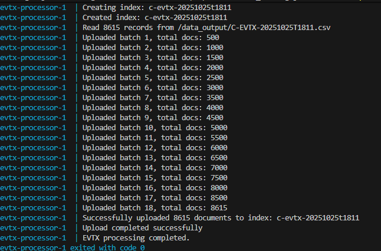
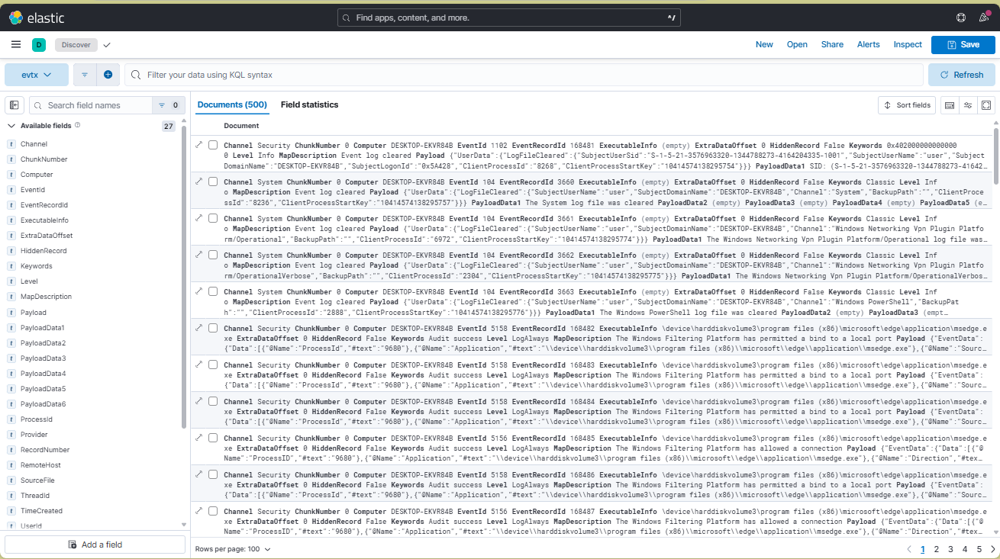
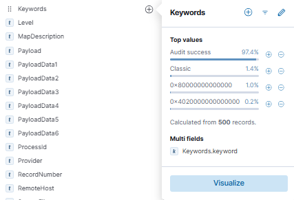
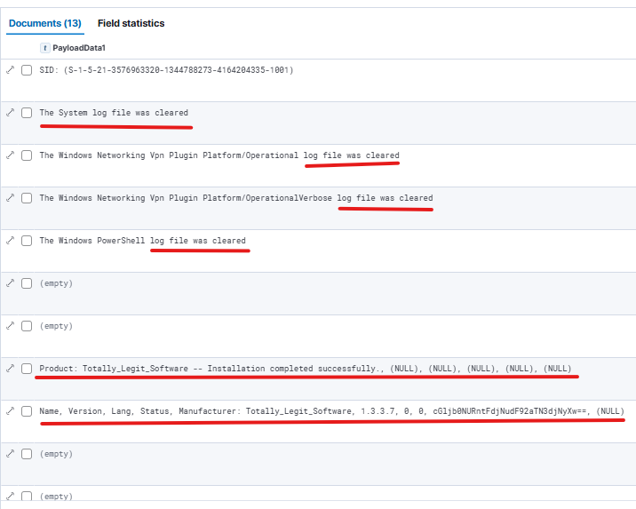
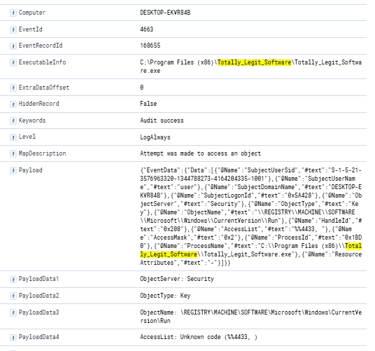
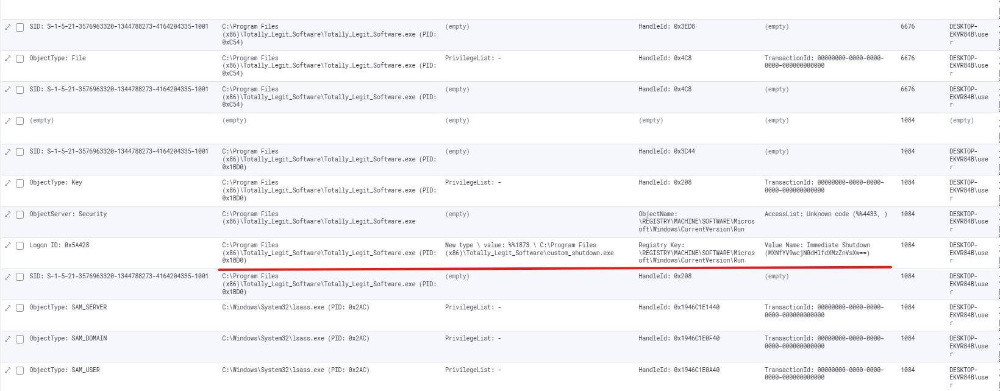
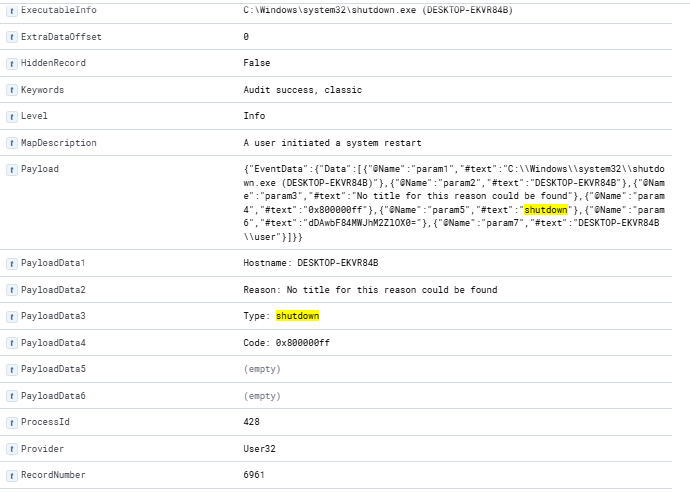
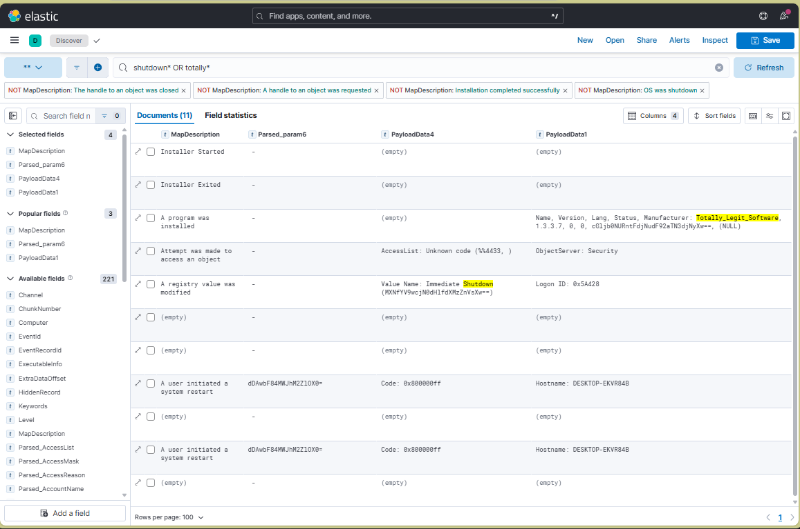

## Description

**Author: Venax**

One of the employees at your company has their computer infected by malware! Turns out every time they try to switch on the computer, it shuts down right after they log in. The story given by the employee is as follows:

1. They installed software using an installer they downloaded online
2. They ran the installed software but it seemed to do nothing
3. Now every time they bootup and login to their computer, a black command prompt screen quickly opens and closes and their computer shuts down instantly.
 
See if you can find evidence for the each of these events and retrieve the flag (split into 3 pieces) from the correct logs!
Download the Windows Log file here

- [Local - Windows_Logs.evtx](Windows_Logs.evtx)
- [PicoCTF Hosted - Windows_Logs.evtx](https://challenge-files.picoctf.net/c_verbal_sleep/123d9b79cadb6b44ab6ae912f25bf9cc18498e8addee851e7d349416c7ffc1e1/Windows_Logs.evtx)

---

## Writeup

For this case I wanted to try out a tool for timelineing I made recently called `JELK`, which is a `docker compose ` setup to auto ingest MFT, EVTX, and Registry into a reusable ELK stack. You can find it here: <http://github.com/jonesckevin/jelk>.  

As seen in this photo, I move the evtx into the data_input folder under the general windows log structure and do a `docker compose up -d` to start the ingestion.

As you can see from the Kibana it did load all the logs successfully.

Originally I found the first part by looking for any weird filters that stood out. The Access keyword `0x80000000000000` was one of 3 that felt weird as apposed to audit success being 99%. So Once I filtered those out, it left me with 13 to quickly look at. 

It brought me to this event record `2373` containing the first part of the flag in base64: `cGljb0NURntFdjNudF92aTN3djNyXw==` which decodes to `picoCTF{Ev3nt_vi3wv3r_`.

`Name, Version, Lang, Status, Manufacturer: Totally_Legit_Software, 1.3.3.7, 0, 0, cGljb0NURntFdjNudF92aTN3djNyXw==, (NULL)`

---

Next I decided to search the File/Process name of `Totally_Legit_Software` to see if it appeared anywhere else in the logs. The first thing I notice is the event id `4663` which is related to file access; and in this case access to add `Totally_Legit_Software` to `\REGISTRY\MACHINE\SOFTWARE\Microsoft\Windows\CurrentVersion\Run`. 

---

As we track down the next one. We have the software and we know it's installed. THe next this the story says is that everytime they boot up and login, a black command prompt quickly opens and closes. As a spoiler, this program is likely `cmd.exe`. But when we focus on the registry from the last step, we can find the actual registry modification event `4657` that shows the value data being set.  
- `New type \ value: %%1873 \ C:\Program Files (x86)\Totally_Legit_Software\custom_shutdown.exe`  
- `Value Name: Immediate Shutdown (MXNfYV9wcjN0dHlfdXMzZnVsXw==)` which decodes to `1s_a_pr3tty_us3ful_`

---

The last thing to do is to check if shutdown was ran. In this case I searched for shutdown to see what results showed up. The event `1074` shows 

---

Finally I scoped it down for a final image view.

---

## Flag Answer

Click to reveal the flag

Flag Part 1: `cGljb0NURntFdjNudF92aTN3djNyXw==` // `picoCTF{Ev3nt_vi3wv3r_`
Flag Part 2: `MXNfYV9wcjN0dHlfdXMzZnVsXw==` // `1s_a_pr3tty_us3ful_`
Flag Part 3: `dDAwbF84MWJhM2ZlOX0=` // `t00l_81ba3fe9}`

Full: `picoCTF{Ev3nt_vi3wv3r_1s_a_pr3tty_us3ful_t00l_81ba3fe9}`

---

### Extra Resource:

If you are up for cheating you can use this online tool to extract LSB data:  
<https://github.com/jonesckevin/jelk>