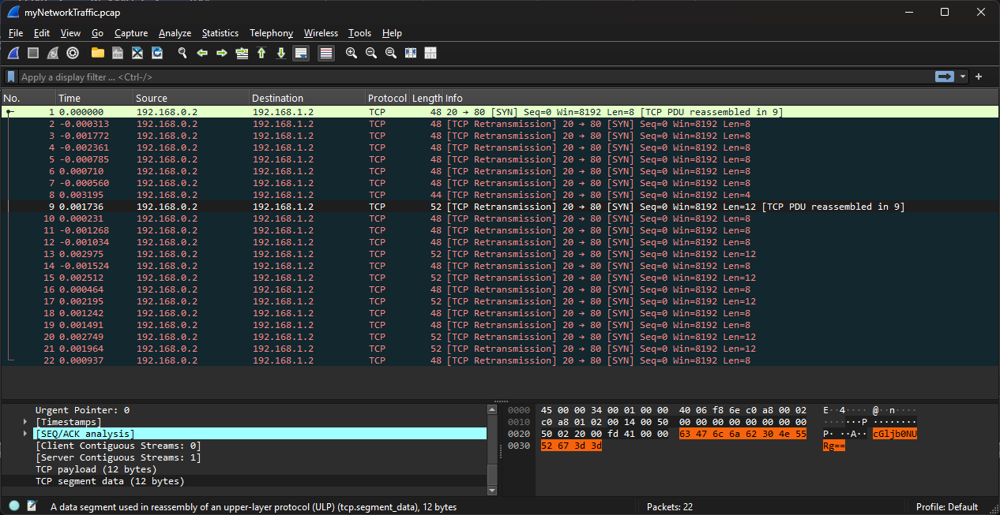
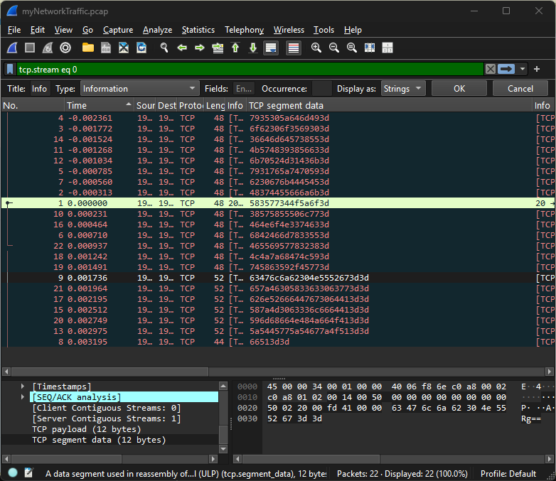
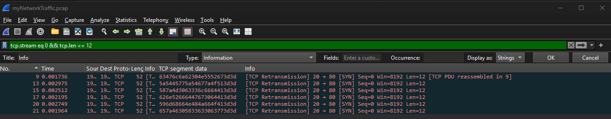

## Description

**Author: Prince Niyonshuti N.**

A digital ghost has breached my defenses, and my sensitive data has been stolen! 😱💻 Your mission is to uncover how this phantom intruder infiltrated my system and retrieve the hidden flag.  

To solve this challenge, you'll need to analyze the provided PCAP file and track down the attack method. The attacker has cleverly concealed his moves in well timely manner. Dive into the network traffic, apply the right filters and show off your forensic prowess and unmask the digital intruder!  

Find the PCAP file here [Network Traffic PCAP](myNetworkTraffic.pcap) file and try to get the flag.


[Local Download](myNetworkTraffic.pcap)

<https://challenge-files.picoctf.net/c_verbal_sleep/4d25aca04e2409ba0d917d8ed27d49c6fb616ff9603fa3926712cce623a3d7f5/myNetworkTraffic.pcap>

---

## What I did

For PCAP the first thing I like to do is to check if it's the file first as per usual.

```bash
file myNetworkTraffic.pcap

# 
```

1. Next I opened the pcap file in TCPDUMP to get a quick overview of the traffic. This one is very small so it was easy to see the output.

```bash
sudo apt install tcpdump
tcpdump -r myNetworkTraffic.pcap
```

```log
22:32:10.520313 IP 192.168.0.2.ftp-data > 192.168.1.2.http: Flags [S], seq 0:8, win 8192, length 8: HTTP
22:32:10.520000 IP 192.168.0.2.ftp-data > 192.168.1.2.http: Flags [S], seq 0:8, win 8192, length 8: HTTP
22:32:10.518541 IP 192.168.0.2.ftp-data > 192.168.1.2.http: Flags [S], seq 0:8, win 8192, length 8: HTTP
22:32:10.517952 IP 192.168.0.2.ftp-data > 192.168.1.2.http: Flags [S], seq 0:8, win 8192, length 8: HTTP
22:32:10.519528 IP 192.168.0.2.ftp-data > 192.168.1.2.http: Flags [S], seq 0:8, win 8192, length 8: HTTP
22:32:10.521023 IP 192.168.0.2.ftp-data > 192.168.1.2.http: Flags [S], seq 0:8, win 8192, length 8: HTTP
22:32:10.519753 IP 192.168.0.2.ftp-data > 192.168.1.2.http: Flags [S], seq 0:8, win 8192, length 8: HTTP
22:32:10.523508 IP 192.168.0.2.ftp-data > 192.168.1.2.http: Flags [S], seq 0:4, win 8192, length 4: HTTP
22:32:10.522049 IP 192.168.0.2.ftp-data > 192.168.1.2.http: Flags [S], seq 0:12, win 8192, length 12: HTTP
22:32:10.520544 IP 192.168.0.2.ftp-data > 192.168.1.2.http: Flags [S], seq 0:8, win 8192, length 8: HTTP
22:32:10.519045 IP 192.168.0.2.ftp-data > 192.168.1.2.http: Flags [S], seq 0:8, win 8192, length 8: HTTP
22:32:10.519279 IP 192.168.0.2.ftp-data > 192.168.1.2.http: Flags [S], seq 0:8, win 8192, length 8: HTTP
22:32:10.523288 IP 192.168.0.2.ftp-data > 192.168.1.2.http: Flags [S], seq 0:12, win 8192, length 12: HTTP
22:32:10.518789 IP 192.168.0.2.ftp-data > 192.168.1.2.http: Flags [S], seq 0:8, win 8192, length 8: HTTP
22:32:10.522825 IP 192.168.0.2.ftp-data > 192.168.1.2.http: Flags [S], seq 0:12, win 8192, length 12: HTTP
22:32:10.520777 IP 192.168.0.2.ftp-data > 192.168.1.2.http: Flags [S], seq 0:8, win 8192, length 8: HTTP
22:32:10.522508 IP 192.168.0.2.ftp-data > 192.168.1.2.http: Flags [S], seq 0:12, win 8192, length 12: HTTP
22:32:10.521555 IP 192.168.0.2.ftp-data > 192.168.1.2.http: Flags [S], seq 0:8, win 8192, length 8: HTTP
22:32:10.521804 IP 192.168.0.2.ftp-data > 192.168.1.2.http: Flags [S], seq 0:8, win 8192, length 8: HTTP
22:32:10.523062 IP 192.168.0.2.ftp-data > 192.168.1.2.http: Flags [S], seq 0:12, win 8192, length 12: HTTP
22:32:10.522277 IP 192.168.0.2.ftp-data > 192.168.1.2.http: Flags [S], seq 0:12, win 8192, length 12: HTTP
22:32:10.521250 IP 192.168.0.2.ftp-data > 192.168.1.2.http: Flags [S], seq 0:8, win 8192, length 8: HTTP
```

2. From the output I could see that there is FTP traffic so I opened the pcap file in Wireshark and applied the filter for FTP protocol to analyze the traffic. I like to use TSHARK for filtering as well.

```wireshark
tcp.port == 21
```

```bash
sudo apt install tshark
tshark -r myNetworkTraffic.pcap -Y "ftp"

# Nil Results
```

3. Since there was no useful information in the FTP traffic, I decided to check the HTTP traffic as well by applying the filter for HTTP protocol.

```bash
tshark -r myNetworkTraffic.pcap -Y "http"


# Nil Results
```

4. There was no useful information in the HTTP traffic as well. So I decided to check for any files that were transferred over the network using TSHARK with the show hex option. since the file is small I can just take a quick look. I opted to show only the hex output to make it easier to read. 

> I opted to shorten some of my wasted time for using CLI on this one. You can see that packet 9 is out of order and it has a lot of data compared to the other packets. So I decided to check that packet in Wireshark.
> ```tshark -r myNetworkTraffic.pcap -Y "frame.number == 9" -x
>
>

```bash
shark -r myNetworkTraffic.pcap -Y "frame.number == 9" -x
```
```bash
Frame (52 bytes):
0000  45 00 00 34 00 01 00 00 40 06 f8 6e c0 a8 00 02   E..4....@..n....
0010  c0 a8 01 02 00 14 00 50 00 00 00 00 00 00 00 00   .......P........
0020  50 02 20 00 fd 41 00 00 63 47 6c 6a 62 30 4e 55   P. ..A..cGljb0NU
0030  52 67 3d 3d                                       Rg==

# Reassembled TCP (12 bytes):
# 0000  58 35 77 34 4f 5a 6f 3d 52 67 3d 3d               X5w4OZo=Rg==
```

If you decode `X5w4OZo=Rg==` you get `picoCTF` which is not the flag. But you know it's near by.. So I am going to go into wireshark the the chump I am who didn't in the first place.

```bash
echo "X5w4OZo=Rg==" | base64 -d
# picoCTF
```

5. In Wireshark, I went to packet 9 and followed the TCP stream to see the full data that was transferred in that packet.



6. What I ended up doing was looking for the `TCP segment data` since that is where all the data is in this case.



Funny enough the First packet became the top packet in the results which I already decoded to `picoCTF`.



Using the follwowing TSHARK command I was able to extract all the TCP payloads with length of 12 bytes.

```bash
tshark -r myNetworkTraffic.pcap -T fields -e frame.time -e frame.number -e tcp.payload | sort | awk '{print $NF}' | tail -n 7 | while read hex; do echo -n "$hex" | xxd -r -p | base64 -d; done; echo
```

| Command/Switch                 | description                                                                    |
| ------------------------------ | ------------------------------------------------------------------------------ |
| tshark                         | The command-line version of Wireshark                                          |
| `-r` myNetworkTraffic.pcap     | Read the pcap file                                                             |
| `-T` fields                    | Specify that we want to extract specific fields                                |
| `-e` frame.time                | Extract the frame time                                                         |
| `-e` frame.number              | Extract the frame number                                                       |
| `-e` tcp.payload               | Extract the TCP payload                                                        |
| `sort`                         | Sort the output                                                                |
| `awk '{print $NF}'`            | Print the last field of each line (NF = Number Field)                          |
| `tail -n 7`                    | Get the last 7 lines of the output                                             |
| `while read hex; do ...; done` | Loop through each hex string, convert to binary, decode from base64, and print |
| `echo -n "$hex"`               | Print the hex string without a newline                                         |
| `xxd -r -p`                    | Convert hex to binary                                                          |
| `base64 -d`                    | Decode from base64                                                             |

---

<details>
<summary> Click to reveal the flag </summary>

```bash
  63476c6a62304e5552673d3d  : picoCTF
  657a46305833633063773d3d  : {1t_w4s
  626e52666447673064413d3d  : nt_th4t
  587a4d3063336c6664413d3d  : _34sy_t
  596d68664e484a664f413d3d  : bh_4r_8
  5a5445775a54677a4f513d3d  : e10e839
  66513d3d                  : }
```

**Flag:** `picoCTF{1t_w4snt_th4t_34sy_tbh_4r_8e10e839}`

</details>

---

### Extra Resource:

If you are up for cheating you can use this online tool to extract LSB data:  
<https://www.aperisolve.com/>